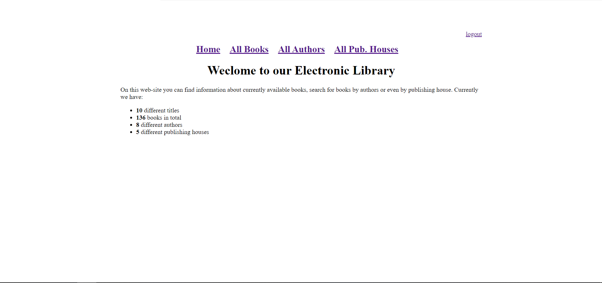
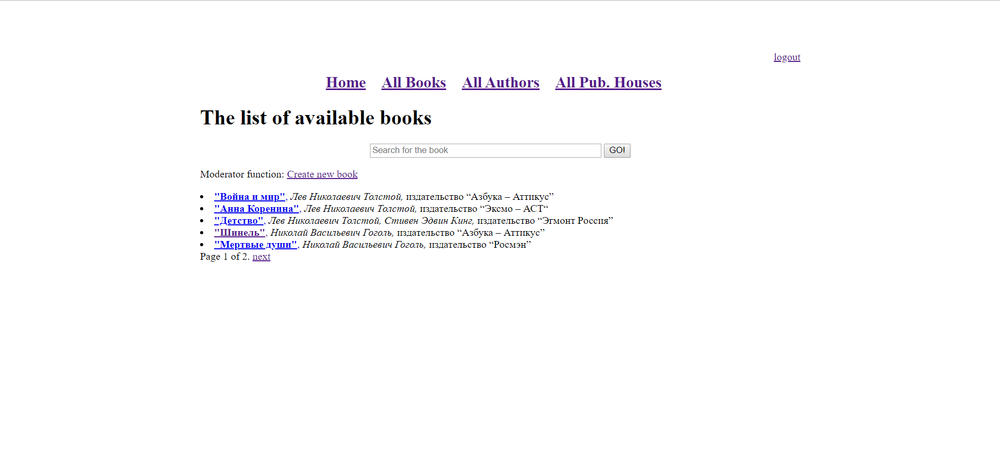
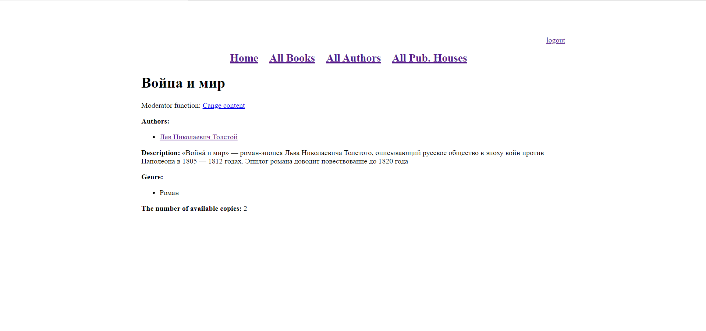
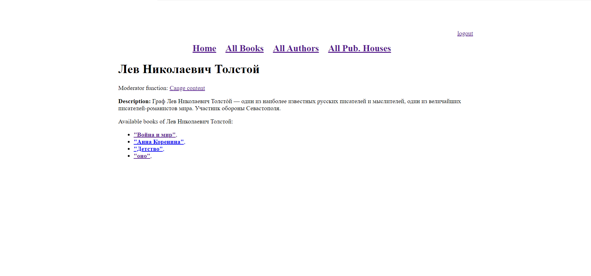
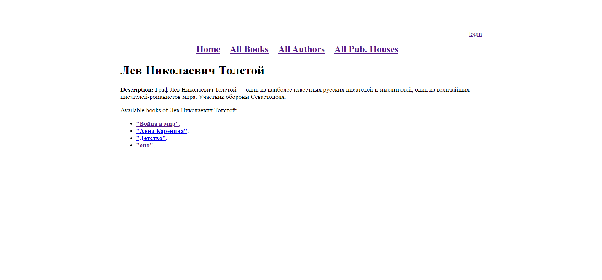
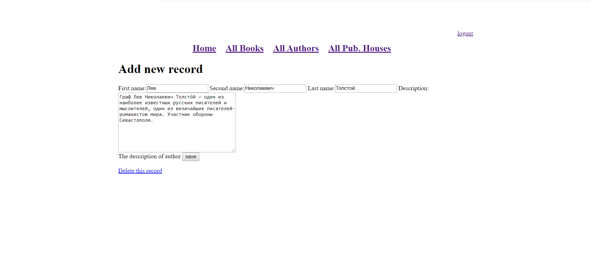
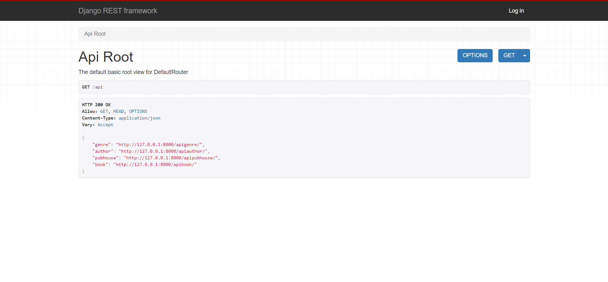
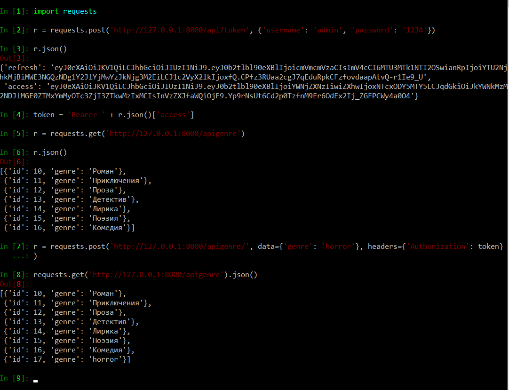
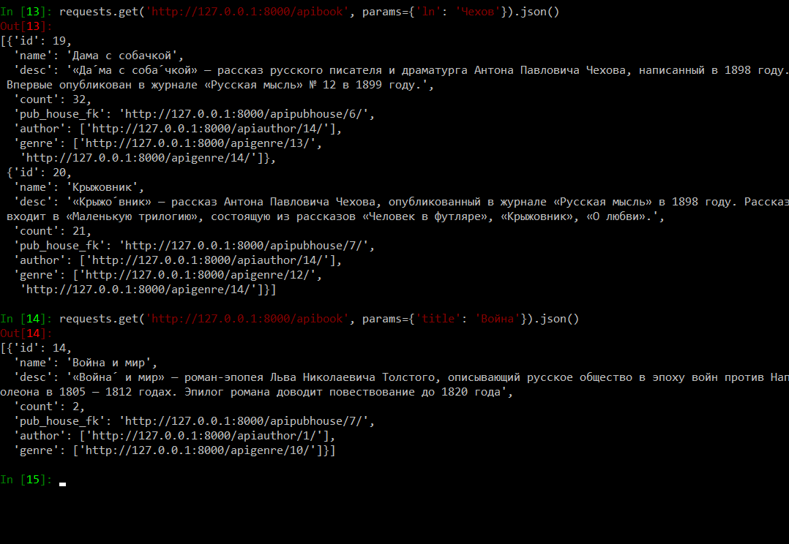

# Основные возможности

Главный (домашний) экран, вверху пристутствуют ссылки для навигадии между разделами.

Окно поиска книг по названию (по умолчанию отображаются все):

Подробная информация о книге: название, автор, описание, жанры, количество доступных копий.

Окна "все авторы" и "все издатели аналогичны". Ниже представлена страница с подробной информацией о книге.

Для авторизированных пользователей (библиотекарей) доступна функция изменения записи (для неавторизированных пользователей она не отображается):

Страница изменения записи:

# REST API

Реализованы 4 функции для API:

- поиск книг
- получение списка всех авторов 
- получение списка издателей
- получение списка жанров

Также присутствует возможность иззменять записи, но она доступна только библиотекарям. Для этого им нужно получить токен доступа к апи:

Пример поиска книг:

